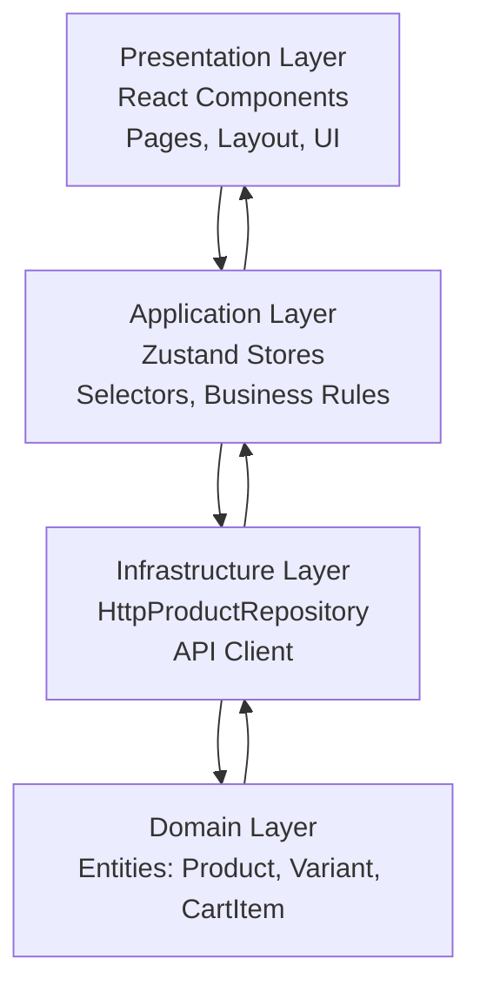
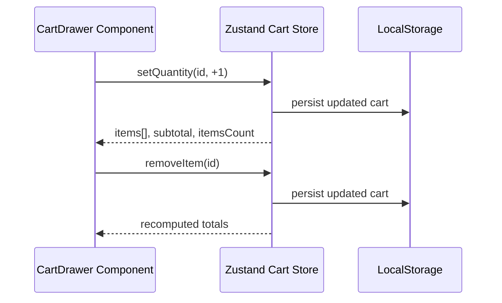
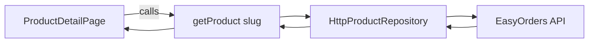
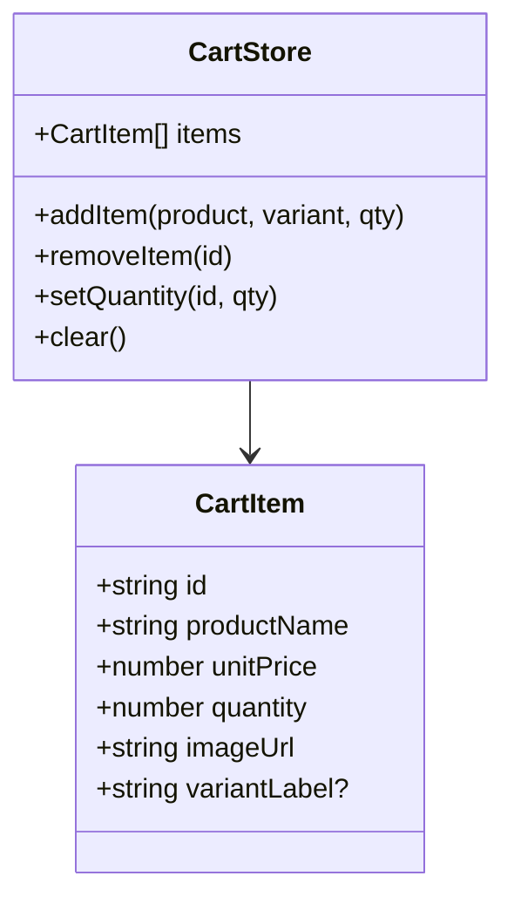
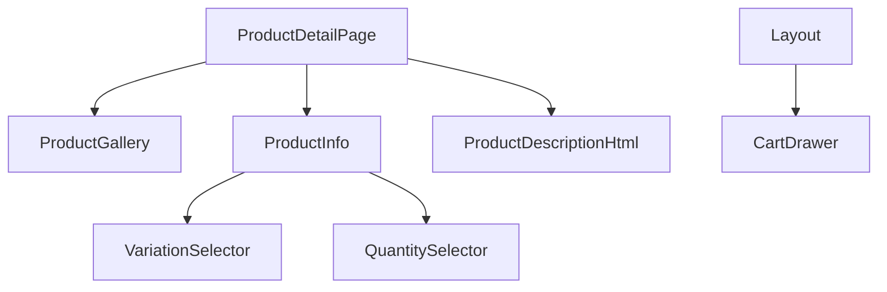

<p align="center">
  
  
  
  
  
  
</p>

## 📌 Overview

This project is an implementation of an E-commerce Product Detail Page based on a Figma design.

### It demonstrates:

- Clean Architecture principles
- Reactive state management using Zustand + Immer
- Persistent shopping cart
- Dynamic product variations (color, size, etc.)
- Mobile & desktop responsive layouts
- A full cart drawer with quantity updates
- HTML product description with “See more” functionality
- API integration with EasyOrders using a Repository pattern

## 🧱 Architecture
### 🏛️ Clean Architecture (Frontend)

This project splits the codebase into Domain, Application, Infrastructure, and Presentation layers.

Architecture Diagram


This ensures UI, state, API logic, and entities are cleanly separated.

## 📂 Folder Structure
```
src/
  domain/
    product.ts
    cart.ts

  application/
    state/
      productStore.ts
      cartStore.ts

    repositories/
      ProductRepository.ts

  infrastructure/
    http/
      apiClient.ts
    HttpProductRepository.ts

  presentation/
    layouts/
      Layout.tsx

    pages/
      ProductDetailPage.tsx

    components/
      product/
        ProductGallery.tsx
        ProductInfo.tsx
        VariationSelector.tsx
        QuantitySelector.tsx
        ProductDescriptionHtml.tsx
      cart/
        CartDrawer.tsx
```

## 🧰 Key Features Implemented

### 1️⃣ Product Detail Page UI
- Image gallery
- Variations
- Price + Sale price
- Quantity selector
- Add to Cart
- Responsive layout (Mobile & Desktop)

### 2️⃣ Layout (Header System)
Responsive navigation:
- Desktop → search, categories, wishlist, cart
- Mobile → search, cart badge, hamburger menu

### 3️⃣ Cart Drawer (Slide-out Panel)



### 4️⃣ Product Description — "See More"

HTML description is:
- Cleanly truncated using plain text extraction
- Expanded to full HTML via dangerouslySetInnerHTML
- Mobile-safe (no overflow)

### 5️⃣ API Integration (Repository Pattern)


### 🧠 Zustand Store: Cart Logic


### 🧩 Component Hierarchy



